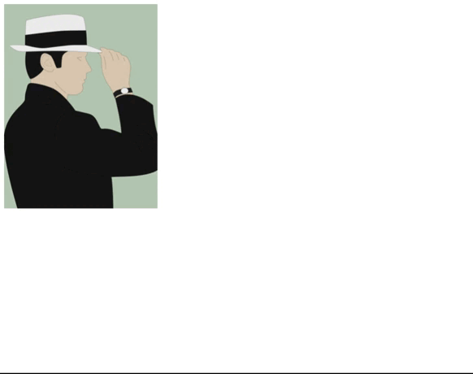

#jquery插件

1、[访window弹窗全屏最小化及拖拽](#访window弹窗全屏最小化及拖拽)

2、[打字机](#打字机)

3、[图片放大器](#图片放大器)


##### 访window弹窗全屏最小化及拖拽
###### 使用
```
引入jquery.win.js、jquery.win.css文件

<link rel="stylesheet" type="text/css" href="jquery.win.css">
<script type="text/javascript" src="jquery.win.js"></script>

html
<div id='win'>这是一个测试div</div>

javascript
$('#win').lyfwin_effect();
```
###### 参数
width：可选，窗口宽度

height：可选，窗口高度

title：可选，窗口标题

###### 预览


##### 打字机
###### 使用
```
引入jquery.word.js、jquery.word.css文件

<link rel="stylesheet" type="text/css" href="jquery.word.css">
<script type="text/javascript" src="jquery.word.js"></script>

html
<div class="content">content test</div>
<div class="contentlist">
    <span class="word-group">test1</span>
    <span class="word-group">test2</span>
    <span class="word-group">test3</span>
</div>

javascript
$('.content').typelist({
    'covercolor':'#bae8ce',
    'recycle':0,
});
$('.contentlist').wordslist();
```
###### 参数
covercolor：可选，选中内容时背景颜色

recycle：可选，1-循环，0-不循环
###### 预览


##### 图片放大器
###### 使用
```
引入js/css文件

<link rel="stylesheet" href="magnify.css" />
<script type="text/javascript" src="magnify.js"></script>

html
<div id="test"></div>

javascript
var param = {
	divid:'test',
	orgimg:'image2_thumb.jpg',
	orgwidth:300,
	orgheight:400,
	bigimg:'image2_large.jpg',
	bigwidth:900,
	bigheight:1200
};
var mag = new Magnify(param);
```
###### 参数
divid：dom元素id

orgimg：展示图片

orgwidth：展示图片宽度

orgheight：展示图片高度

bigimg：放大图片

bigwidth：放大图片宽度

bigheight：放大图片高度

###### 预览
